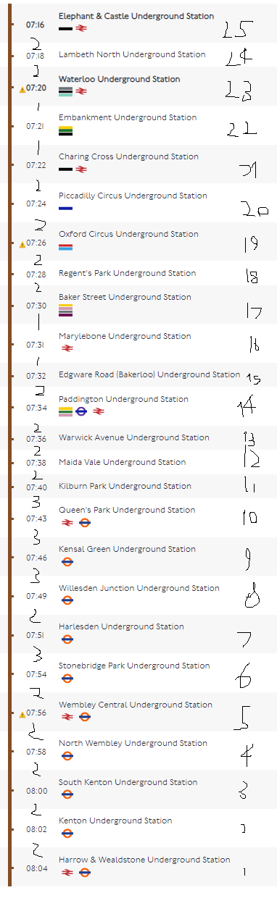

# SQL Challenge

## Learning Objectives

- SQL Language
- SQL Functions

## Instructions

To create a Database for the London Underground, starting with the Bakerloo line. The table should store information about the stations on the line and all of the services that they offer.

## Core Criteria

Design a suitable table structure that include Line, Station, Services tables. If you would like to include anything else you are free to do so. Also ensure that your design:

- deals with station closures
- shows what other services are available at the station and allow for possible future services. e.g. Paddington now offers the new 'Elizabeth Line' as well as 'Network Rail' services

Write sql queries to:

- Create tables Line, Station, Services
- Insert into tables Line, Station, Services
- Set Maida Vale Station as closed
- Select all open stations
- Select stations from Marylebone to Piccadilly Circus that are closed
- Select stations Elephant & Castle to Harrow & Wealdstone that have 'Network Rail' services (see the stations with the train in the image)
- Select stations from Lambeth North to Kensal Green

| Id  | StationName           | Services                                                                                |
| --- | --------------------- | ----------------------------------------------------------------------------------------|
| 1   | Harrow & Wealdstone   | Bakerloo Line, London Overground, National Rail                                         |
| 2   | "Kenton"              | Bakerloo Line, London Overground                                                        |
| 3   | "South Kenton"        | Bakerloo Line, London Overground                                                        |
| 4   | "North Wembley"       | Bakerloo Line, London Overground                                                        |
| 5   | "Wembley Central"     | Bakerloo Line, London Overground, National Rail                                         |
| 6   | "Stonebridge Park"    | Bakerloo Line, London Overground                                                        |
| 7   | "Harlesden"           | Bakerloo Line, London Overground                                                        |
| 8   | "Willesden Junction"  | Bakerloo Line, London Overground                                                        |
| 9   | "Kensel Green"        | Bakerloo Line, London Overground                                                        |
| 10  | "Queens Park"         | Bakerloo Line, London Overground                                                        |
| 11  | "Kilburn Park"        | Bakerloo Line                                                                           |
| 12  | "Maida Vale"          | Bakerloo Line                                                                           |
| 13  | "Warwick Avenue"      | Bakerloo Line                                                                           |
| 14  | "Paddington"          | Bakerloo Line, Circle Line, District Line, Hammersmith & City Line, National Rail       |
| 15  | "Edgeware Road"       | Bakerloo Line, Circle Line, District Line, Hammersmith & City Line                      |
| 16  | "Marylebone"          | Bakerloo Line, National Rail                                                            |
| 17  | "Baker Street"        | Bakerloo Line, Circle Line, Hammersmith & City Line, Jubilee Line, Metropolitan Line    |
| 18  | "Regents Park"        | Bakerloo Line                                                                           |
| 19  | "Oxford Circus"       | Bakerloo Line, Central Line, Victoria Line                                              |
| 20  | "Piccadilly Circus"   | Bakerloo Line, Piccadilly Line                                                          |
| 21  | "Charing Cross"       | Bakerloo Line, Northern Line, National Rail                                             |
| 22  | "Embankment"          | Bakerloo Line, Circle Line, District Line, Northern Line                                |
| 23  | "Waterloo"            | Bakerloo Line, Jubilee Line, Northern Line, Waterloo & City Line, National Rail         |
| 24  | "Lambeth North"       | Bakerloo Line                                                                           |
| 25  | "Elephant and Castle" | Bakerloo Line, Northern Line, National Rail                                             |

 | All Services              |
 | ------------------------- |
 | Bakerloo Line,            |
 | London Overground         |
 | National Rail             |
 | Circle Line               |
 | District Line             |
 | Hammersmith & City Line   |
 | Jubilee Line              |
 | Metropolitan Line         |
 | Victoria Line             |
 | Piccadilly Line           |
 | Northern Line             |
 | Waterloo & City Line      |
 

## Extension Criteria #1 - Zones

Include Zones in your database design.

- Write a [Postgres Function](https://www.postgresql.org/docs/current/sql-createfunction.html) to append the Zone to the Name e.g.

  | Start               | End                  |
  | ------------------- | -------------------- |
  | Marylebone (Zone 1) | Northfields (Zone 3) |

NOTE                          : do not write the Zone into the name of the station column!

## Extension Criteria #2 - Journey Times

Update your design and write a [Postgres Function](https://www.postgresql.org/docs/current/sql-createfunction.html) that when passed two station ID's it calculates the time between the stations

Write a query to get the start and end stations with a journey time column
| Start | End | Journey Time |
| --- | --------------- | --- |
| Marylebone | Baker Street | 57 minutes |

## Super Extension Criteria #3

- Add the Picadilly line to your database design
- Write a query to show my old commute from Marylebone to Northfields making sure your function can deal with another line. e.g.

| Start      | End         | Journey Time |
| ---------- | ----------- | ------------ |
| Marylebone | Northfields | 57 minutes   |
